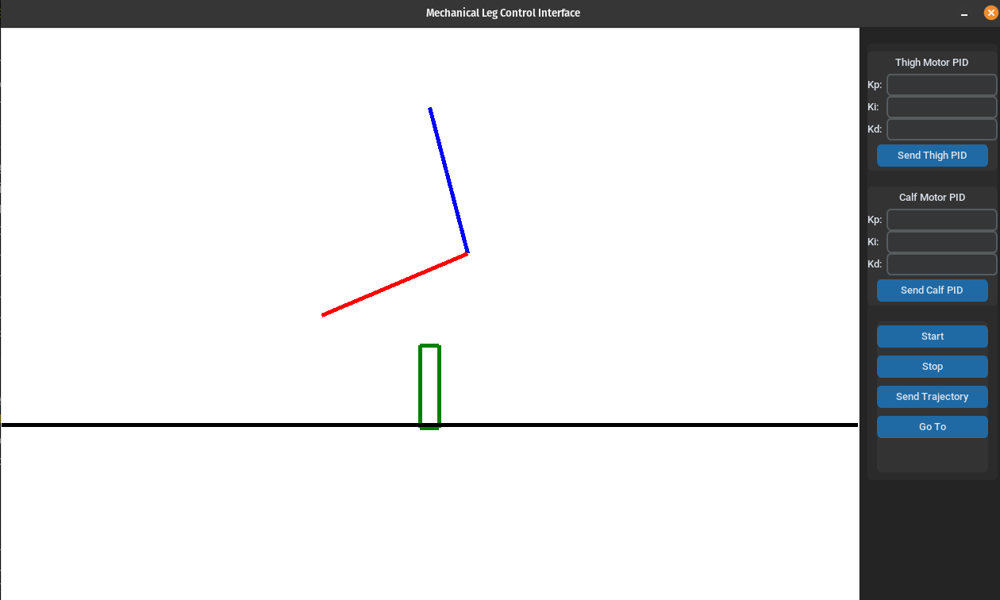

# PI7-GUI

Interface gráfica para utilizar na disciplina PI7, ministrada no primeiro semestre de 2024.

## Dependências

- Python 3.8
- Customtkinter

## Instalação

```bash
pip3 install customtkinter
```

## A interface

A interface é composta de um desenho, à direita, que corresponde à perna mecânica de um robô. À esquerda, há um conjunto de botões que permitem controlar a posição dessa perna na prática.



No momento, os comandos não estão integrados com o comando real do robô. Apenas a interface foi implementada, com os prints no terminal correspondentes a cada botão pressionado.

## Funcionalidades

- **Configuração PID**: Ajuste dos parâmetros PID (Kp, Ki, Kd) para os motores da coxa e da panturrilha.
- **Comandos de Movimento**: Envio de comandos de início, parada e envio de trajetórias para a perna.
- **Visualização da Perna**: Interface gráfica que mostra a posição da perna virtual e permite a manipulação da mesma com o mouse.
- **Simulação e Controle Real**: Integração com microcontroladores para espelhar a posição da perna física na interface virtual.

## Exemplos de Comandos

### Configuração PID

- Ajuste os valores de Kp, Ki, e Kd para os motores da coxa e da panturrilha nas entradas correspondentes e clique em "Send Thigh PID" ou "Send Calf PID".

### Envio de Trajetórias

- Clique no botão "Send Trajectory" para enviar a trajetória pré-definida para a perna mecânica.

### Início e Parada de Movimentos

- Clique em "Start" para iniciar o movimento da perna baseado na trajetória carregada.
- Clique em "Stop" para interromper o movimento.